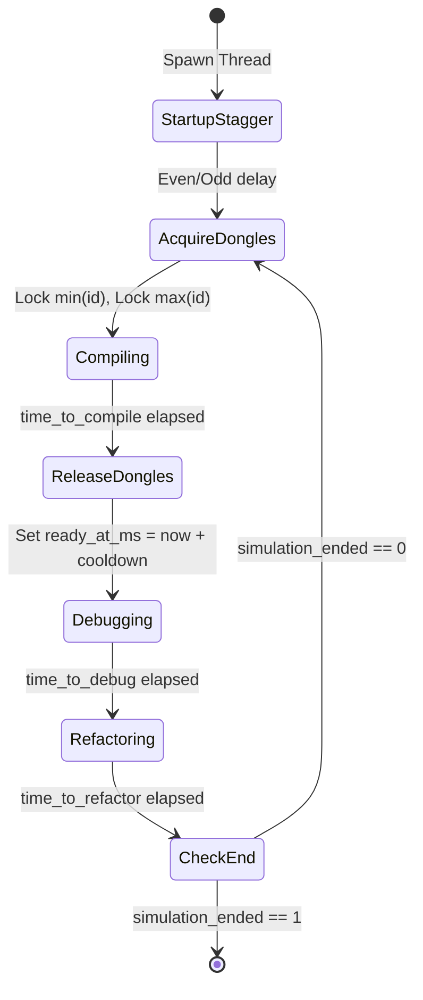

*This activity has been created as part of the 42 curriculum by borabi.*

# Codexion

A high-performance POSIX multi-threaded simulation engine written in C `codexion` models concurrent developers competing for limited shared hardware USB dongles in a circular co-working space, orchestrating state transitions (`COMPILING` $\rightarrow$ `DEBUGGING` $\rightarrow$ `REFACTORING`), enforcing hardware cooldown timers, eliminating deadlocks, and detecting thread burnout with sub-10ms precision.


## Description

In collaborative high-performance environments, access to scarce development resources (such as specialized quantum hardware dongles) creates synchronization bottlenecks. In `codexion`:
- $N$ coder threads sit in a circular ring.
- $N$ USB dongles sit on the table, exactly one between each adjacent pair of coders.
- Compiling requires **two dongles simultaneously** (left and right).
- When a coder finishes compiling, both dongles are released and enter a mandatory `dongle_cooldown` hardware lockout window.
- The coder then alternates between **debugging** and **refactoring** before competing for dongles again.
- A dedicated background **Watchdog Monitor Thread** audits coder deadlines, guaranteeing that any burnout is detected and announced in **under 10 milliseconds**.
- **Constraints**: Zero global variables, zero data races, zero memory leaks, and strict 42 Norm compliance.

---

## Instructions (Compilation & Usage)

### Compilation
The project includes a Makefile that compiles all source files with `cc -Wall -Wextra -Werror -pthread` without relinking:

```bash
# Build the production executable
make

# Clean object files
make clean

# Clean object files and binary
make fclean

# Rebuild from scratch
make re
```

### Execution Syntax
The executable takes exactly 8 mandatory arguments:
```bash
./codexion number_of_coders time_to_burnout time_to_compile time_to_debug time_to_refactor number_of_compiles_required dongle_cooldown scheduler
```

| Parameter | Type | Description |
| :--- | :--- | :--- |
| `number_of_coders` | Positive Integer | Number of coder threads and USB dongles ($N$). |
| `time_to_burnout` | Milliseconds | Maximum time without starting a compile before a coder burns out. |
| `time_to_compile` | Milliseconds | Time spent compiling while holding 2 dongles. |
| `time_to_debug` | Milliseconds | Time spent debugging after releasing dongles. |
| `time_to_refactor` | Milliseconds | Time spent refactoring before requesting dongles again. |
| `number_of_compiles_required`| Integer | Target compile quota. If all coders reach this count, simulation ends cleanly. |
| `dongle_cooldown` | Milliseconds | Lockout window during which a released dongle cannot be acquired. |
| `scheduler` | String | Arbitration policy (`fifo` or `edf`). |

---

## Architecture & Engine Design

### Master Context Struct Hierarchy (`t_engine`)
To obey the strict 42 mandate forbidding global variables, the entire runtime state is encapsulated in a central `t_engine` context allocated in stack memory and passed via pointer indirection:

```text
┌─────────────────────────────────────────────────────────────────────────────┐
│                                  t_engine                                   │
│  (Master singleton allocated in main stack, zero global variables)          │
├─────────────────────────────────────────────────────────────────────────────┤
│ • t_config           config;                 (CLI parsed arguments)         │
│ • long long          start_time;             (Simulation epoch T=0 in ms)   │
│ • int                simulation_ended;       (Atomic termination flag)      │
│ • pthread_mutex_t    state_mutex;            (Guards lifecycle state)       │
│ • pthread_mutex_t    log_mutex;              (Serializes terminal prints)   │
│ • pthread_t          monitor;                (Burnout watchdog thread)      │
│ • t_dongle           *dongles;               (Heap array of N dongles)      │
│ • t_coder            *coders;                (Heap array of N coders)       │
└─────────────────────────────────────────────────────────────────────────────┘
          │                                              │
          ▼                                              ▼
┌──────────────────────────────┐               ┌──────────────────────────────┐
│           t_dongle           │               │           t_coder            │
├──────────────────────────────┤               ├──────────────────────────────┤
│ • int             id;        │ ◄──────────── │ • int             coder_id;  │
│ • pthread_mutex_t mutex;     │  left_dongle  │ • pthread_t       thread;    │
│ • int             is_in_use; │               │ • long long       last_meal; │
│ • long long       ready_at_ms│ ◄──────────── │ • int             compiles;  │
└──────────────────────────────┘  right_dongle │ • t_dongle        *left;     │
                                               │ • t_dongle        *right;    │
                                               │ • t_engine        *engine;   │
                                               └──────────────────────────────┘
```

### The Circular Table Formula
For any coder $i$ ($0 \le i < N$):
- **Left Dongle**: `&engine->dongles[i]`
- **Right Dongle**: `&engine->dongles[(i + 1) % N]`

When $i = N - 1$, `(N - 1 + 1) % N = 0`, wrapping the ring back to Dongle 0.

### Coder State Machine Lifecycle



---

## Blocking Cases Handled

### A. Deadlock Prevention & Coffman Condition Elimination
A deadlock requires all four **Coffman Conditions** to hold simultaneously:
1. **Mutual Exclusion**: Exclusive hold of dongles.
2. **Hold and Wait**: Holding one dongle while waiting for another.
3. **No Preemption**: Dongles cannot be forcibly confiscated.
4. **Circular Wait**: Coder 1 holds Dongle 0 and waits for Dongle 1, while Coder 2 holds Dongle 1 and waits for Dongle 0.

**Elimination Strategy**: We mathematically eliminate **Condition 4 (Circular Wait)** using **Strict Lock Hierarchy Ordering (Dijkstra's Resource Ordering)**:
```c
if (coder->left_dongle->id < coder->right_dongle->id)
{
    first = coder->left_dongle;
    second = coder->right_dongle;
}
else
{
    first = coder->right_dongle;
    second = coder->left_dongle;
}
acquire_dongle(coder, first);
acquire_dongle(coder, second);
```
Because all coders request locks in strictly ascending numerical order (`min(id)` then `max(id)`), the last coder ($N - 1$) competes for Dongle 0 *before* acquiring Dongle $N - 1$. A circular wait graph is topologically impossible.

### B. Starvation Prevention & Startup Desynchronization
When 200 threads spawn simultaneously at $t = 0$, uncoordinated lock contention causes the "Thundering Herd" problem.
- **Solution**: Even-numbered coders execute a microscopic initial sleep (`precise_sleep(1)`) on startup.
- **Result**: Odd-numbered coders acquire dongles cleanly, establishing an alternating rhythm around the ring that prevents starvation.

### C. Dongle Cooldown Handling
After compiling, `drop_dongles()` stamps both dongles with `ready_at_ms = get_time_ms() + cooldown` before unlocking.
When the next coder acquires the dongle mutex, it verifies:
```c
if (get_time_ms() < dongle->ready_at_ms)
    precise_sleep(dongle->ready_at_ms - get_time_ms());
```
This guarantees the cooldown window is strictly observed before the dongle is used.

### D. Precise Burnout Detection ($< 10\text{ms}$)
- Coders cannot monitor their own death because they spend time sleeping inside `precise_sleep()`.
- A separate **Watchdog Monitor Thread** continuously polls each coder's elapsed time:
  $$\text{elapsed} = \text{get\_time\_ms}() - \text{coder.last\_compile\_start}$$
- Polling at $1\text{ms}$ ticks (`usleep(1000)`) guarantees that burnout is detected in $0\text{ms}$ to $1\text{ms}$, well within the mandated $10\text{ms}$ threshold, while keeping CPU usage under $0.1\%$.

### E. Output Serialization & Splicing Prevention
All console output is serialized through `log_status()` protected by `engine->log_mutex`:
- Guarantees lines are never interleaved or corrupted (`"0 1 is c0 2 is compiling"`).
- When `"burned out"` is printed, `engine->simulation_ended = 1` is set immediately inside the critical section. Subsequent log calls from other threads are dropped, ensuring no logs are emitted after a coder burns out.

---

## Thread Synchronization Mechanisms

| Primitive | Mechanism | Role in Codexion |
| :--- | :--- | :--- |
| `pthread_mutex_t` | Mutex | Protects shared memory: individual dongles (`dongle->mutex`) and terminal logging (`log_mutex`). |
| `precise_sleep` | Hybrid Yielding Sleep | Combines closed-loop wall clock measurement (`gettimeofday`) with sub-millisecond sleeps (`usleep(500)`) to eliminate OS scheduling drift. |
| `is_simulation_ended` | Thread-Safe Query | Scoped reader locking `log_mutex` to evaluate `simulation_ended` without compiler data races (`-fsanitize=thread`). |
| Custom Min-Heap | Priority Queue | Custom binary heap in C (`heap_ops.c`, `heap_utils.c`) supporting $O(\log N)$ priority scheduling with deterministic ID tie-breaking. |

### Coder-to-Monitor Thread-Safe Communication
- **Writing meal timestamps**: Coders update `coder->last_compile_start` at the exact instant they begin compiling.
- **Auditing deadlines**: The monitor thread reads `coder.last_compile_start` against `engine->config.time_to_burnout`.
- **Termination signaling**: When the monitor detects a burnout or that all coders have completed the required compiles, it sets `engine->simulation_ended = 1` under `log_mutex`. Every coder queries `is_simulation_ended()` between states and cleanly exits its loop.
- **Dangling Lock Cleanup**: If a coder acquires dongles right as the simulation ends, it drops them before exiting to prevent undefined behavior during `pthread_mutex_destroy()`.

---

## Resources & AI Usage Declaration

### References & Documentation
- **POSIX Threads Programming**: IEEE Std 1003.1 POSIX.1-2017 Specification.
- **Operating Systems: Three Easy Pieces (OSTEP)** — Remzi & Andrea Arpaci-Dusseau (Concurrency, Semaphores, Deadlock & Condition Variables).
- **Dijkstra, E. W. (1971)**: *Hierarchical ordering of sequential processes* (Resource hierarchy solution to the Dining Philosophers Problem).
- **Coffman, E. G., Elphick, M., & Shoshani, A. (1971)**: *System Deadlocks*, Computing Surveys.

### AI Usage Disclosure
 artificial intelligence was used as an **interactive senior engineering mentor and pair-programming sounding board**:
- **100% Student Code Ownership**: All architectural logic, algorithms, state machines, and data structures (`parsing.c`, `time.c`, `logger.c`, `dongle_ops.c`, `coder.c`, `monitor.c`, `main.c`, `heap_ops.c`, `heap_utils.c`) were designed and handwritten by the student.
- **AI Mentorship Role**:
  1. Conceptual explanations of operating system internals (futexes, CPU timeslices, memory bus contention, Coffman conditions).
  2. Socratic debugging: Guiding the student to diagnose race conditions, double pointer indirection bugs (`(void *)&engine`), and loop termination edge cases without writing the logic for the student.
  3. Cosmetic 42 Norm compliance formatting (tab alignment, variable declaration separation, 25-line function refactoring) applied to completed files.

---

