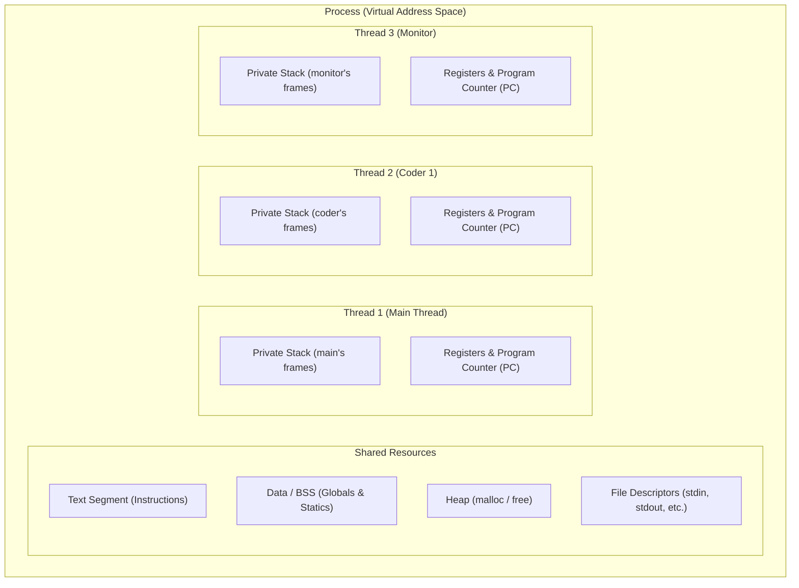

[[MOC|⬅️ Back to Map of Content]]

# Lesson 01: Concurrency Primitives (`pthread_create`, `pthread_join`)

---

## 1. Why Concurrency Primitives Exist

In classical computing, software execution is strictly **sequential**: the CPU fetches instruction $N$, executes it, increments its internal instruction pointer, and fetches instruction $N+1$.

When building systems that coordinate multiple independent actors—such as multiple software engineers competing for shared hardware dongles in `codexion`—sequential execution fails:
- If Coder 1 spends 200 ms compiling, a single-threaded program is blocked. Coder 2 cannot check their burnout timer, leading to false starvation.
- Traditional multitasking relied on processes created via `fork(2)`. However, `fork` duplicates the entire virtual address space (via copy-on-write). Inter-Process Communication (IPC) across isolated memory spaces requires heavy OS intervention (pipes, sockets, shared memory segments) and costly context switches.

**POSIX Threads (`pthreads`)** provide lightweight execution units operating directly within the **same virtual address space**, enabling zero-copy state sharing and microsecond context switching.

---

## 2. Operating System Mental Model

### Process vs. Thread

> [!TIP]
> **The Workshop Analogy**:
> - A **Process** is the entire workshop building. It has an address, security keys, shared toolboxes, material stock, and whiteboards.
> - A **Thread** is an individual worker moving inside that workshop.
> - Each worker has their own notebook and pen in their pocket (Registers & Stack) to keep track of their immediate thoughts and scratchpad calculations.
> - Any worker can walk over to the shared whiteboard or toolbox (Heap & Data Segment) and read or modify it at any time.



### Memory Space Breakdown

| Memory Segment | Scope across Threads | What it Contains |
| :--- | :--- | :--- |
| **Text Segment** | **Shared** | Read-only compiled machine instructions |
| **Data / BSS** | **Shared** | Global variables and static variables |
| **Heap** | **Shared** | Dynamically allocated memory via `malloc()` |
| **File Descriptors** | **Shared** | Open files, sockets, terminal handles |
| **Stack** | **Strictly Private** | Local variables, function call frames, return addresses |
| **Registers / PC** | **Strictly Private** | Current CPU instruction pointer, stack pointer, scratch registers |

---

## 3. POSIX Thread API Mechanics

### 1. Spawning: `pthread_create`

```c
#include <pthread.h>

int pthread_create(pthread_t *thread,
                   const pthread_attr_t *attr,
                   void *(*start_routine)(void *),
                   void *arg);
```

#### Under the Hood:
1. The kernel allocates a dedicated stack (typically 2MB to 8MB) and a new thread execution control block (TCB) inside the current process.
2. `thread`: Pointer to a `pthread_t` variable where the runtime writes the unique handle/identifier of the spawned thread.
3. `attr`: Attributes object. Passing `NULL` configures system defaults (joinable, standard stack size).
4. `start_routine`: Function pointer with signature `void *(*func)(void *)`. This is the entry point where the newly minted thread begins execution.
5. `arg`: Generic `void *` pointer passed directly as the argument to `start_routine`.
6. **Return Value**: Returns `0` on success. On failure, it returns a non-zero error number (e.g., `EAGAIN`).

> [!WARNING]
> Unlike standard POSIX syscalls (`read`, `write`, `fork`), `pthread_create` does **NOT** return `-1` and does **NOT** set `errno`. It returns the error code directly!

---

### 2. Reaping & Synchronizing: `pthread_join`

```c
int pthread_join(pthread_t thread, void **retval);
```

#### Under the Hood:
1. **Suspension**: Halts the calling thread until the target `thread` finishes its execution routine or calls `pthread_exit`.
2. **Reclamation**: Reclaims the thread's private stack and internal OS metadata. If a joinable thread is never joined or detached, a resource leak occurs (analogous to zombie processes).
3. `retval`: Double pointer `void **`. If non-null, the exit status returned by the target thread's `start_routine` is copied into `*retval`.

---

## 4. Deep Systems Pitfalls

### Pitfall A: The Loop Variable Pointer Trap
```c
/* FATAL SYSTEM BUG */
for (int i = 0; i < 5; i++)
{
    pthread_create(&threads[i], NULL, coder_routine, &i);
}
```
**Why this breaks**:
- `i` resides at a fixed memory address on `main`'s stack (e.g., `0x7ffee0`).
- Thread creation is asynchronous. While the OS schedules Thread 0, `main`'s loop rapidly increments `i` from `0` to `5`.
- When Thread 0 dereferences `*(int *)arg`, it reads whatever value is in `0x7ffee0` at that microsecond (often `5`).
- Multiple threads end up with the same identifier, or corrupted state.

**Two Safe Solutions**:
1. **Pass by Value (Intptr Cast)**: Cast the integer directly to a `void *` pointer (`(void *)(intptr_t)i`). This passes the integer inside the CPU argument register rather than passing a pointer.
2. **Dedicated Struct Array**: Allocate an array of configuration structs (`t_coder_args args[N]`) and pass `&args[i]`. Each thread gets a unique, immutable memory address.

---

### Pitfall B: Premature Termination of `main()`
In C, the initial thread executes `main()`. If `main()` reaches `return 0;`:
- The C runtime invokes the `exit_group(2)` system call.
- The OS tears down the entire virtual address space immediately.
- Any background worker threads are violently terminated mid-instruction, potentially corrupting files or memory state.
- `pthread_join` is the barrier that prevents `main()` from exiting before its workers finish.

> [!TIP]
> For a full visual breakdown with OS-level diagrams and the zombie-thread scenario, see:
> 📖 [[Deep_Dive_Without_Pthread_Join|Deep Dive: What Happens When You Don't Call pthread_join()?]]

---

### Pitfall C: Returning Local Stack Addresses
```c
void *worker_func(void *arg)
{
    int result = 42;
    return (&result); /* FATAL: Dangling pointer! */
}
```
When `worker_func` returns, the thread's stack frame is popped and invalidated. Dereferencing this pointer in `main` via `pthread_join(&status)` yields undefined behavior / garbage.

---

## 5. Connection to Codexion

In `codexion`:
- Every coder from `1` to `number_of_coders` is created via `pthread_create`.
- A dedicated **Monitor Thread** is launched alongside the coders to track burnout deadlines.
- Clean shutdown requires joining all coder threads and the monitor thread before freeing resources.

---

## 6. Hands-on Lab Exercise: `lab01_threads`

### Objective
Build a multithreaded testbed without race conditions or memory leaks that demonstrates full mastery of `pthread_create` and `pthread_join`.

### Specifications:
1. Program name: `lab01_threads`
2. Directory: `labs/01_concurrency_primitives/`
3. Spawn $N$ worker threads (e.g., $N = 5$ or read from CLI).
4. Each worker thread must receive:
   - A unique ID ($1$ to $N$).
   - A custom simulation parameter (e.g., work duration in milliseconds).
5. Pass parameters **safely without race conditions** (use a dedicated struct per thread).
6. Each worker must print:
   ```
   [Thread <id>] Started. Internal TID: <pthread_self()>, Will work for <X> ms.
   ```
7. Simulate work using `usleep(work_ms * 1000)`.
8. Each thread must dynamically allocate an exit summary struct or integer return code and return it.
9. `main()` must:
   - Wait for all $N$ threads using `pthread_join`.
   - Retrieve and print each thread's return value.
   - Clean up all allocated memory.
10. Compilation flags: `cc -Wall -Wextra -Werror -pthread`
11. Memory & thread check: zero leaks with Valgrind / zero races with `-fsanitize=thread`.

---

## 7. Deep Dives & Lessons Learned

During the execution of this lab, two critical architectural deep-dives were documented:
1. 📖 [[Deep_Dive_joining|Deep Dive: What Happens When You Don't Call pthread_join()?]] (Sudden death vs. zombie thread resource exhaustion)
2. 📖 [[Deep_Dive_Pointers_Stack_Heap_Retval|Deep Dive: Pointers, Memory Architecture, and the &retval Trap]] (Pass-by-reference in C, `free(&retval)` compiler errors, pointer overwrite leaks, and `printf` interleaving)
