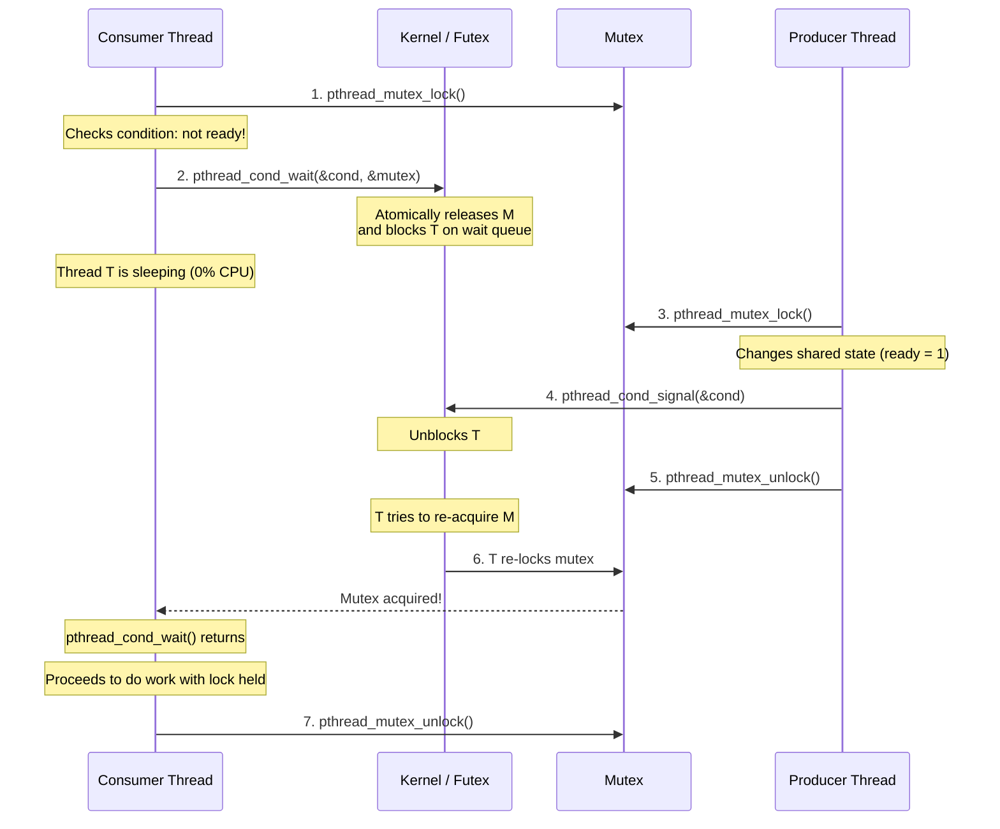

[[MOC|⬅️ Back to Map of Content]]

# Lesson 04: Condition Variables (`pthread_cond_*`, Spurious Wakeups)

---

## 1. Why Do Condition Variables Exist?

In multithreaded systems, threads often need to wait for a specific **state condition** to become true before they can proceed. For example:
- A worker thread waiting for a job queue to be non-empty.
- A coder in `codexion` waiting for both left and right dongles to be released and cooled down.
- A thread waiting for a shared buffer to have space.

### The Naive Flawed Approach: Polling / Busy-Waiting
What happens if a thread only has a mutex?
```c
/* FATAL PATTERN: Spinlock / Busy-Waiting */
while (1)
{
    pthread_mutex_lock(&lock);
    if (dongle_is_available == 1)
    {
        dongle_is_available = 0;
        pthread_mutex_unlock(&lock);
        break;
    }
    pthread_mutex_unlock(&lock);
    /* Maybe usleep(100) or immediate repeat */
}
```

### Why this is disastrous:
1. **CPU Starvation & Heat**: The waiting thread burns CPU cycles constantly locking, checking, unlocking, and repeating millions of times per second.
2. **Lock Contention**: The thread repeatedly locks the mutex, preventing the producer thread (which needs to acquire the lock to set `dongle_is_available = 1`) from ever getting the mutex!
3. **Latency vs. Power Tradeoff**: If you add `usleep(1000)` to save CPU, you introduce up to 1ms of unnecessary latency before the thread notices the state change.

### The Solution: Event-Driven Signaling
A **Condition Variable** (`pthread_cond_t`) allows a thread to **sleep completely** (consuming 0% CPU, placed on a kernel wait queue) until another thread explicitly wakes it up by signaling: *"Hey, the state changed! Wake up and check!"*

---

## 2. Big Picture: Where It Fits in the System

A mutex provides **mutual exclusion** (protecting shared variables from race conditions).
A condition variable provides **signaling and waiting** (coordinating *when* work should happen based on shared state).

> [!IMPORTANT]
> **A Condition Variable is NOT a lock, and it does NOT store state!**
> It has no counter, no boolean flag, and no memory of past signals. It is purely a **notification channel** (a queue of waiting threads).

```text
+-------------------------------------------------------------------------+
|                              SHARED STATE                               |
|        (Protected by Mutex: int queue_size, int dongle_available)       |
+-------------------------------------------------------------------------+
         ▲                                                │
         │ Mutex Lock                                     │ Signal Event
         ▼                                                ▼
+---------------------+                          +------------------------+
|   CONSUMER THREAD   |                          |    PRODUCER THREAD     |
|  1. Lock mutex      |                          |  1. Lock mutex         |
|  2. While (!ready)  |                          |  2. Modify state       |
|     cond_wait()     | ◄═══════════════════════ |  3. cond_signal()      |
|  3. Do work         |     Wake up signal       |  4. Unlock mutex       |
|  4. Unlock mutex    |                          +------------------------+
+---------------------+
```

---

## 3. Mental Model

### The Doctor's Waiting Room
Imagine visiting a doctor:
- **Without Condition Variables (Polling)**: You walk into the doctor's office every 2 seconds, open the door, ask *"Are you ready for me yet?"*, get told no, step outside, and repeat. You drive the doctor crazy and wear out the door lock.
- **With Condition Variables**:
  1. You check in at the reception desk (**Acquire Mutex**).
  2. The receptionist tells you the doctor isn't ready.
  3. You sit down in the waiting room and take a nap (**`pthread_cond_wait`**: atomically release the desk and go to sleep).
  4. When the doctor is ready, the receptionist calls your name (**`pthread_cond_signal`**).
  5. You wake up, walk back to the desk, confirm the doctor is indeed ready, and enter (**Re-acquire Mutex**).

---

## 4. Internal Mechanics: The Magic of `pthread_cond_wait`

The signature of `pthread_cond_wait` reveals its secret:
```c
int pthread_cond_wait(pthread_cond_t *cond, pthread_mutex_t *mutex);
```

### Why does it require the mutex?
Inside `pthread_cond_wait`, three operations occur in an **atomic** kernel transition:
1. **Atomically Release the Mutex & Enqueue**: The kernel places the calling thread on the condition variable's sleep wait queue AND releases the associated mutex simultaneously.
   - *Why atomic?* If releasing the lock and going to sleep were two separate steps, another thread could swoop in between them, modify the state, fire the signal, and you would miss the signal forever (the **Lost Wakeup Bug**)!
2. **Put Thread to Sleep (0% CPU)**: The thread's state is changed to blocked (`TASK_UNINTERRUPTIBLE` / `FUTEX_WAIT`). It consumes zero CPU cycles.
3. **Re-acquire the Mutex upon Waking**: When another thread calls `pthread_cond_signal` or `pthread_cond_broadcast`, the sleeping thread is woken up. **Before `pthread_cond_wait` returns to your code, it re-acquires the mutex!**



---

## 5. The Inviolable Golden Rule: Always Use `while`, NEVER `if`

Every junior engineer writes this bug at least once:
```c
/* ❌ DEADLY BUG: Using if with cond_wait */
pthread_mutex_lock(&mutex);
if (queue_is_empty)
{
    pthread_cond_wait(&cond, &mutex);
}
/* Pop item from queue (CRASH / DATA RACE!) */
pthread_mutex_unlock(&mutex);
```

### The Correct Canonical Pattern:
```c
/* ✅ CORRECT: Always check condition in a while loop */
pthread_mutex_lock(&mutex);
while (queue_is_empty)
{
    pthread_cond_wait(&cond, &mutex);
}
/* Pop item from queue (Guaranteed Safe) */
pthread_mutex_unlock(&mutex);
```

### Why is `while` mandatory?
1. **Spurious Wakeups**: POSIX systems and Linux kernel futex implementations are permitted by the specification to wake up a sleeping thread **without any signal being sent** (e.g. due to internal OS signal handling or context switches). If woken spuriously, an `if` statement would proceed even though `queue_is_empty` is still true!
2. **The Stolen Resource (Thundering Herd)**: If Thread A wakes up because an item was produced, but before Thread A re-acquires the mutex, Thread B grabs the mutex, consumes the item, and unlocks. When Thread A finally gets the mutex, the queue is empty again! The `while` loop forces Thread A to re-check and go back to sleep.

---

## 6. Minimal Independent Example

```c
#include <stdio.h>
#include <pthread.h>
#include <unistd.h>

typedef struct s_work_hub
{
    int             ready;
    pthread_mutex_t lock;
    pthread_cond_t  cond;
}   t_work_hub;

void    *worker_thread(void *arg)
{
    t_work_hub *hub = (t_work_hub *)arg;

    pthread_mutex_lock(&hub->lock);
    printf("[Worker] Waiting for signal...\n");
    while (hub->ready == 0)
    {
        pthread_cond_wait(&hub->cond, &hub->lock);
    }
    printf("[Worker] Signal received! Doing work.\n");
    pthread_mutex_unlock(&hub->lock);
    return (NULL);
}

int main(void)
{
    t_work_hub  hub;
    pthread_t   worker;

    hub.ready = 0;
    pthread_mutex_init(&hub->lock, NULL);
    pthread_cond_init(&hub->cond, NULL);

    pthread_create(&worker, NULL, worker_thread, &hub);

    sleep(1); // Simulate some preparation work

    pthread_mutex_lock(&hub->lock);
    hub.ready = 1;
    printf("[Main] Work prepared. Signaling worker!\n");
    pthread_cond_signal(&hub->cond);
    pthread_mutex_unlock(&hub->lock);

    pthread_join(worker, NULL);
    pthread_mutex_destroy(&hub->lock);
    pthread_cond_destroy(&hub->cond);
    return (0);
}
```

---

## 7. Project Context: Where This Applies to `codexion`

In `codexion`, threads need to coordinate without eating 100% CPU:
1. **Dongle Arbitration**: When a dongle is taken or in `dongle_cooldown`, other coders can wait on a condition variable rather than spinning continuously in a lock-unlock frenzy.
2. **Scheduler Queue**: When coders submit compile requests, the scheduler queue can signal the arbitration logic when new requests arrive.
3. **Graceful Shutdown**: When a coder burns out, a broadcast signal can immediately wake all sleeping coders to exit cleanly without waiting for arbitrary sleep timers.

---

## 8. Common Pitfalls

| Pitfall | Consequence | Prevention |
| :--- | :--- | :--- |
| **Using `if` instead of `while`** | Thread crashes or reads invalid data when woken spuriously or by a competing thread. | Always wrap `pthread_cond_wait` in `while (condition)`. |
| **Calling `cond_wait` without holding the mutex** | Undefined behavior, immediate crashes, or missed wakeups. | Always lock the mutex before entering the `while` check and calling `cond_wait`. |
| **Signal without modifying state** | Thread wakes up, checks condition, finds it still false, goes right back to sleep. | Always update the shared boolean/state variable under the mutex before signaling. |
| **`signal` vs. `broadcast` confusion** | `signal` wakes **one** thread; `broadcast` wakes **all** waiting threads. If multiple threads could proceed, `signal` can cause permanent stalls. | Use `broadcast` when multiple waiting threads may be affected or during shutdown. |

---

## 9. Conceptual Check Questions

Before we write any code in the lab, answer these two foundational questions:

1. **Why does `pthread_cond_wait(&cond, &mutex)` take the address of the `mutex` as an argument? What does the kernel do to that mutex when you go to sleep, and what does it do right before `cond_wait` returns?**
2. **Explain in your own words what a "spurious wakeup" is, and why using `if (ready == 0)` instead of `while (ready == 0)` can cause a catastrophic crash.**
