[[MOC|⬅️ Back to Map of Content]]

# 🧠 Master Concepts to Revisit (Phase-by-Phase Matrix)

As we advance through the phases toward final submission, this document acts as our **permanent memory bank**. Every systems concept, OS pitfall, and memory pattern learned in the labs is mapped directly to the future project phase where it must be applied.

---

## 📌 Phase 1: Foundation Primitives

| # | Mastered Concept | Core OS / Language Mechanic | Why & Where to Revisit in Future Phases |
| :--- | :--- | :--- | :--- |
| **01** | **Stack vs. Heap Memory** | Each thread has a private stack; process heap is shared and persistent. Returning stack addresses creates dangling pointers. | 📍 **Phase 3, Step 2**: Coder struct allocation. Coders cannot share stack variables; all shared state must live in heap-allocated `t_engine` or array structs. |
| **02** | **The Loop Variable Trap** | Passing `&i` or `&tdata` to `pthread_create` creates a race condition because asynchronous threads read from a shared/moving stack address. | 📍 **Phase 2 & Phase 3, Step 2**: Initializing the ring of coders. Coders must receive `&coders[i]` (dedicated immutable memory addresses). |
| **03** | **Zombie Threads & Reaping** | Threads that exit without `pthread_join()` retain their Thread Control Block (TCB) in kernel memory, causing resource exhaustion (`EAGAIN`). | 📍 **Phase 3, Step 5 & 7**: Simulation shutdown. When a coder burns out or all compilation goals are met, `main()` must join every coder and the monitor thread before freeing memory. |
| **04** | **Double Pointer Indirection (`void **retval`)** | C passes arguments by value. `pthread_join` needs `&retval` (address of pointer) to write the thread's return address, while `free(retval)` needs the heap address itself. | 📍 **Phase 3, Step 6**: Collecting simulation exit summaries and monitor error codes cleanly. |
| **05** | **Preemption & Output Splicing** | The CPU context switches mid-execution. Consecutive `printf` calls or concurrent writes to `stdout` get interleaved and scrambled. | 📍 **Phase 1 (Lesson 02) & Phase 3, Step 6**: The 42 automated tester fails if log lines are spliced. All output must be serialized via a dedicated `log_mutex`. |
| **06** | **Atomic Read-Modify-Write** | `counter++` is 3 assembly instructions (Load, Add, Store). Without mutual exclusion, simultaneous writes obliterate data (Data Race). | 📍 **Phase 2 & Phase 3, Step 3**: Managing dongle states (`is_taken`, `cooldown_until`) and coder meal/compile counts without race conditions. |
| **07** | **Deadlocks & Self-Deadlocks** | Locking an already-locked non-recursive mutex puts the thread to sleep waiting for itself, permanently freezing the process. | 📍 **Phase 2 & Phase 3, Step 3**: Preventing Coffman Circular Wait when two coders pick up adjacent dongles in conflicting order. |
| **08** | **Thread Array Bounds & Stack Overflows** | An array of size $N$ (`threads[N]`) has valid indices $0$ to $N-1$. Using `i <= N` overflows the stack and writes an extra handle into arbitrary stack memory. | 📍 **Phase 2 & Phase 3, Step 2**: Ring initialization for $N$ coders and dongles. Loop bounds must be strictly `i < N`. |
| **09** | **Mutex Fast Path vs. Futex Slow Path** | Uncontended mutexes lock in user space via `LOCK CMPXCHG` (~15ns); contended locks invoke `sys_futex` to sleep in the kernel (0% CPU). Long locks cause cache line bouncing. | 📍 **Phase 2 & Phase 3, Step 3**: Dongle arbitration. Critical sections must be strictly minimized (never sleep or I/O inside dongle locks). |
| **10** | **Dot (`.`) vs. Arrow (`->`) Operator** | Dot accesses direct objects (`data.counter`); Arrow accesses pointers (`ptr->counter`), serving as shorthand for `(*ptr).counter`. | 📍 **Phase 2 & Phase 3 (Throughout)**: Navigating nested structures: `engine->coders[i].id` or `coder->left_dongle->is_taken`. |
| **11** | **`usleep` Quantization Drift** | `usleep(t)` guarantees only a lower bound; OS quantum scheduling accumulates drift. Solved by closed-loop verification against a wall clock. | 📍 **Phase 2 & Phase 3, Step 5 & 6**: Pacing coder states (`COMPILING`, `DEBUGGING`, `REFACTORING`) and burnout detection without failing the `< 10ms` spec. |
| **12** | **64-bit Integer Overflow Protection** | Signed 32-bit `int` overflows in ~35 minutes if storing microseconds ($2^{31}-1 \approx 2.147 \times 10^9$). Timestamp calculations must use `long long` and `1000LL`. | 📍 **Phase 3, Step 2, 5 & 6**: All struct timestamp fields (`last_compile_start`, `burnout_deadline`, `start_time`) must be 64-bit integers. |
| **13** | **Hybrid Yielding vs. Spinlock Waste** | An empty `while (elapsed < duration);` burns 100% CPU core and starves other threads. Inserting `usleep(500)` yields the CPU timeslice to the OS while maintaining sub-millisecond precision. | 📍 **Phase 2 & Phase 3, Step 5 & 6**: Custom `ft_usleep` engine used across all simulation worker and monitor threads. |

---

## 🗺️ Future Phase Revisit Map

```mermaid
graph TD
    subgraph Concepts["Mastered Concepts"]
        C1["Stack vs Heap Lifetimes"]
        C2["Loop Pointer Trap (&tdata[i])"]
        C3["Zombie Threads & Clean Reaping"]
        C4["Double Pointers (&retval vs free)"]
        C5["Output Splicing & Mutex Logging"]
        C6["Data Races (counter++)"]
        C7["Deadlocks & Lock Ordering"]
        C11["usleep Drift & Closed-Loop Clock"]
        C12["64-bit Overflow & 1000LL"]
        C13["Hybrid Sleep (usleep 500)"]
    end

    subgraph Phase2["Phase 2: Prototype Simulator"]
        P2_1["2-3 Coder Dongle Arbitration"]
        P2_2["Dongle Cooldown Timer"]
    end

    subgraph Phase3["Phase 3: Production Engine"]
        S2["Step 2: Struct Architecture (t_engine)"]
        S3["Step 3: Deadlock-Free Dongle Ring"]
        S5["Step 5: Coder State Machine Lifecycle"]
        S6["Step 6: Burnout Monitor (< 10ms Precision)"]
        S7["Step 7: Valgrind & TSAN Audit"]
    end

    C1 --> S2
    C2 --> P2_1
    C2 --> S2
    C3 --> S5
    C3 --> S7
    C4 --> S6
    C5 --> S6
    C6 --> P2_1
    C6 --> S3
    C7 --> P2_1
    C7 --> S3
    C11 --> P2_2
    C11 --> S5
    C11 --> S6
    C12 --> S2
    C12 --> S6
    C13 --> S5
    C13 --> S6
```

---

*This matrix is continuously updated as new lessons (Clocks, Condition Variables, Priority Queues) are completed.*
