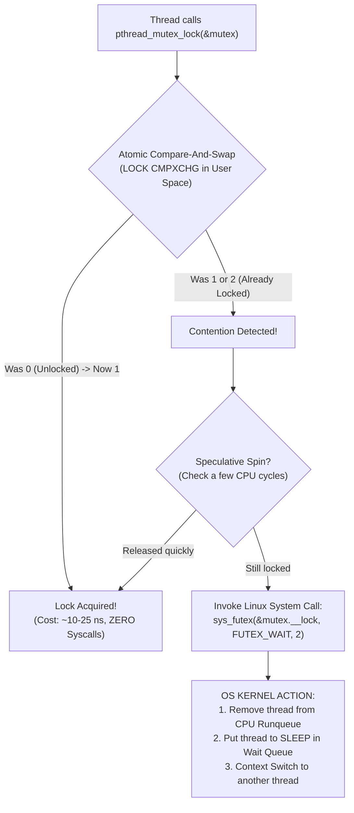
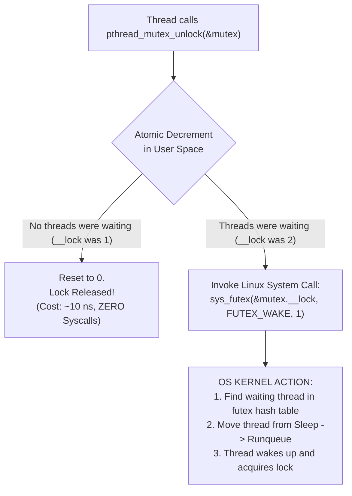

[[MOC|⬅️ Back to Map of Content]] | [[02_Mutexes_and_Critical_Sections|⬅️ Back to Lesson 02]]

# ⚙️ Deep Dive: Mutex Internals, CPU Assembly, and Linux Futexes

How does a mutex actually work at the silicon (CPU), memory, and operating system kernel levels?

---

## 1. Where Does a Mutex Actually Live?

A common misconception among beginner systems programmers is that a mutex lives "inside the kernel." 

**It does not.** A `pthread_mutex_t` is an ordinary C structure that lives directly in **User-Space Virtual Memory**:
- If declared as a local variable inside `main()`, it lives on **`main()`'s Stack**.
- If allocated with `malloc()`, it lives on the **Process Heap**.
- If declared globally (forbidden in 42), it lives in the **Data / BSS Segment**.

### What Is Inside `pthread_mutex_t`?
On 64-bit Linux (glibc), a `pthread_mutex_t` is a 40-byte struct containing internal fields similar to:

```c
struct __pthread_mutex_s
{
    int             __lock;       /* 0 = unlocked, 1 = locked (no waiters), 2 = locked (with waiters) */
    unsigned int    __count;      /* Recursion counter (for recursive mutexes) */
    int             __owner;      /* Thread ID (TID) of the thread holding the lock */
    unsigned int    __nusers;     /* Number of waiting threads */
    int             __kind;       /* Mutex type: NORMAL, RECURSIVE, ERRORCHECK */
    short           __spins;      /* Adaptive spin counter before sleeping */
    short           __elision;    /* Hardware Transactional Memory (TSX) lock elision */
    /* ... pointer to internal wait lists ... */
};
```

---

## 2. What Does the CPU Do During `pthread_mutex_lock`?

Modern operating systems do **not** jump into the kernel for every lock call. Making a system call (`syscall`) costs ~100 to 300 CPU clock cycles. Instead, POSIX mutexes utilize a hybrid approach:



---

### Step A: The Fast Path (100% User Space — ~15 nanoseconds)
When you call `pthread_mutex_lock(&mutex)`, the CPU executes an **Atomic Hardware Instruction**:
- On **x86-64**: `LOCK CMPXCHG` (Atomic Compare-and-Exchange).
- On **ARM64**: `LDREX` / `STREX` (Load-Linked / Store-Conditional) or `CAS`.

#### Hardware Mechanics: The Bus / Cache Lock
1. The CPU core asserts a hardware lock on the specific **64-byte Cache Line** holding the mutex in its L1/L2 cache (via the **MESI Cache Coherency Protocol**).
2. It atomically reads `__lock`:
   - If `__lock == 0` (unlocked): It writes `1` and finishes immediately.
3. **No kernel trap, no context switch, no syscall!** The thread continues executing the critical section within ~15 nanoseconds.

---

### Step B: The Slow Path (Contention & Linux Futexes)
If the lock is already held (`__lock != 0`), the atomic instruction fails. The thread cannot proceed.

Instead of burning 100% of your CPU spinning in an infinite loop, glibc invokes the Linux kernel's secret weapon: **The Fast Userspace Mutex (`futex`)**:

```c
syscall(SYS_futex, &mutex.__lock, FUTEX_WAIT_PRIVATE, 2, NULL, NULL, 0);
```

#### What the OS Kernel Does During `FUTEX_WAIT`:
1. **Ring 3 -> Ring 0 Transition**: The CPU switches from User Mode to Kernel Mode.
2. **Atomic Verification**: The kernel checks if `mutex.__lock` is still `2`. If another thread unlocked it in that exact microsecond, the kernel aborts the sleep and returns immediately.
3. **Descheduling**: The kernel scheduler marks the calling thread as `TASK_UNINTERRUPTIBLE` and places its `task_struct` on an internal kernel **wait queue hash table**.
4. **Context Switch**: The kernel removes the thread from the CPU's active Runqueue and schedules another thread (or process) on that CPU core.
5. **Zero CPU Waste**: While sleeping in the wait queue, the thread consumes **0.00% CPU cycles**.

---

## 3. What Happens During `pthread_mutex_unlock`?



1. **Fast Path**: If `__lock` was `1` (no threads are waiting in line), the CPU atomically resets `__lock = 0`. Zero kernel involvement!
2. **Slow Path**: If `__lock` was `2` (waiters exist in the kernel wait queue), the unlocking thread issues:
   ```c
   syscall(SYS_futex, &mutex.__lock, FUTEX_WAKE_PRIVATE, 1, ...);
   ```
   The kernel wakes up **one** sleeping thread, places it back on the CPU runqueue, and hands over ownership.

---

## 4. Hardware Realities: Cache Bouncing & False Sharing

Why do mutexes get slow when 100 threads compete for them?

1. **Cache Line Invalidation (MESI Protocol)**:
   - Modern CPUs cache memory in 64-byte chunks called **Cache Lines**.
   - When CPU Core 0 modifies `&data.lock` using `LOCK CMPXCHG`, all other CPU cores (Core 1, Core 2, Core 3) holding that cache line receive an invalidation signal.
   - Their L1/L2 caches are forced to flush that line and reload it from L3 cache or RAM over the interconnect bus.
   - This phenomenon is called **Cache Line Bouncing** or **Lock Contention**.

2. **The Golden Rule of Critical Sections**:
   Keep critical sections as **small and fast as possible**!
   - Never do I/O (`printf`, reading files) inside a lock unless specifically serializing output.
   - Never sleep (`usleep`) while holding a lock unless other threads are intentionally meant to wait.

---

## 5. Architectural Comparison Matrix

| Synchronization Primitive | Where it Blocks | CPU Cost When Contended | Best Use Case |
| :--- | :--- | :--- | :--- |
| **POSIX Mutex (`pthread_mutex_t`)** | OS Kernel (`FUTEX_WAIT`) | **0% CPU** (Thread sleeps) | General critical sections, shared resource protection. |
| **Spinlock (`pthread_spinlock_t`)** | CPU Core (Active Loop) | **100% CPU** (Spins continuously) | Extremely short critical sections (< microsecond) where context switch overhead is unacceptable. *(Forbidden in 42)* |
| **Atomic Operations (`stdatomic.h`)** | Silicon / Hardware Bus | Low (1 hardware instruction) | Single integer counters, flags. |
| **Condition Variable (`pthread_cond_t`)** | OS Kernel (`FUTEX_WAIT`) | **0% CPU** (Event-driven wake) | Signaling events between threads (e.g. queue not empty). |
