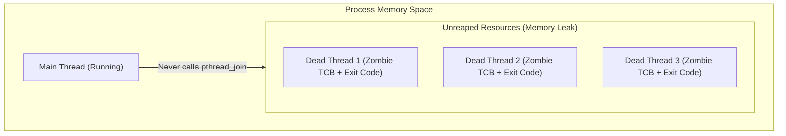

[[MOC|⬅️ Back to Map of Content]] | [[01_Concurrency_Primitives|⬅️ Back to Lesson 01]]

# 💥 What Happens When You Don't Call `pthread_join()`?

To understand what happens when you omit `pthread_join()`, we have to look at the two distinct ways execution can unfold:

1. **Case A**: `main()` finishes and exits while the thread is still working.
2. **Case B**: `main()` continues running forever (or for a long time), while threads finish without being joined.

---

## 🎬 Case A: `main()` Finishes Early (The Sudden Death)

### 1. The Real-Life Analogy: The Landlord & The Workers
Imagine you rent a workshop room (the **Process**).
You hire a contractor (a **Worker Thread**) to build a delicate glass sculpture on a table. The work takes 5 hours.
You (**`main`**) get bored after 10 minutes and decide to hand the keys back to the landlord and demolish the building.

```
       [ Demolition Crane Hits The Building ]
                         |
                         v
       +------------------------------------+
       |  WORKSHOP COLLAPSES INSTANTLY       |
       |  (The contractor didn't get to     |
       |   finish; the glass is shattered)  |
       +------------------------------------+
```

The contractor doesn't get to finish their job, clean their tools, or pack up. Everything inside that building ceases to exist in an instant.

---

### 2. What Happens at the Kernel / CPU Level

```mermaid
sequenceDiagram
    autonumber
    actor OS as OS Kernel
    participant Main as Main Thread
    participant Worker as Worker Thread (Coder)

    Main->>OS: pthread_create(&worker, ...)
    OS->>Worker: Spawn thread & begin execution
    Note over Worker: Doing heavy work...<br/>(e.g., compiling, writing to disk)
    
    Note over Main: main() finishes its lines<br/>and hits "return 0;"
    Main->>OS: exit_group(0) System Call
    
    Note over OS: KERNEL ACTION:<br/>Tear down Virtual Address Space!
    OS-->>Main: Destroyed
    OS--xWorker: KILLED INSTANTLY MID-INSTRUCTION!
```

1. In C, when `main()` executes `return 0;` (or calls `exit()`), the C standard runtime library invokes the Linux system call **`exit_group(2)`**.
2. **`exit_group` does not care about background threads**. It orders the CPU MMU (Memory Management Unit) to tear down and unmap the entire Virtual Address Space (Stack, Heap, Code, File Descriptors).
3. The worker thread is terminated **mid-instruction**:
   - If it was in the middle of a `printf`, the output buffer is lost or truncated.
   - If it was writing data into a heap buffer, the write is incomplete.
   - If it had locked a `pthread_mutex_t`, that mutex is left permanently deadlocked in a poisoned state.

---

### 3. Visual Timeline: With vs. Without `pthread_join()`

#### ❌ WITHOUT `pthread_join()`:
```
Time ------->
Main Thread:   [ Create Worker ] ---> [ return 0 ] (PROCESS DIES)
                                            |
Worker Thread: [ Start Working ] ---------> X (KILLED MID-WAY)
                                       Lost work!
```

#### ✅ WITH `pthread_join()`:
```
Time ------->
Main Thread:   [ Create Worker ] ---> [ WAITING AT JOIN... ] -------------> [ return 0 ] (CLEAN EXIT)
                                                                                  ^
Worker Thread: [ Start Working ] ---------------------> [ Finishes & Returns ] ---|
                                                        Work 100% complete!
```

> [!CAUTION]
> In **Codexion**, if `main()` does not join the coder threads, the simulation could terminate prematurely before coders log their state, leaving race conditions completely untraceable.

---

## 🧟 Case B: `main()` Keeps Running (The Zombie Thread)

Now imagine another scenario: `main()` does **not** exit (it enters an infinite loop, or waits for user input), but it created worker threads and **never called `pthread_join()` on them**.

What happens when those worker threads finish their function?

### 1. The Concept of a "Zombie" Thread

When a thread finishes its routine:
- Its execution stops.
- But its **Thread Control Block (TCB)** and its **Thread Return Status** linger in kernel and process memory.
- The OS keeps this dead shell waiting, because it assumes: *"The creator (`main`) might call `pthread_join` later to read the exit code and reap the resources."*



### 2. The Disaster: Resource Exhaustion (`EAGAIN`)
If your program continues spawning threads (e.g. 100, 1000, 5000 times) without joining them:
1. Each zombie holds onto kernel bookkeeping memory and user-space thread descriptor structures.
2. The operating system has a hard limit on the maximum number of threads a process can create (`/proc/sys/kernel/threads-max` or `ulimit -u`).
3. Eventually, `pthread_create()` fails and returns error code **`EAGAIN`** (*"Resource temporarily unavailable"*).
4. Your application crashes or fails to perform any new work.

---

## 🛡️ Summary Table: The Three Outcomes

| Scenario | What Happens? | Consequence |
| :--- | :--- | :--- |
| **`main()` exits without `pthread_join()`** | Kernel executes `exit_group()`, unmapping all process memory. | **Abrupt Death**: Worker threads are killed mid-execution. Data corruption. |
| **`main()` lives on without `pthread_join()`** | Dead threads remain in memory waiting to be reaped. | **Zombie Threads**: Thread descriptor / memory leak. Eventual `EAGAIN` failure. |
| **`main()` calls `pthread_join()`** | `main()` pauses until the worker finishes, then reclaims all resources. | **Deterministic & Clean**: 100% completed work, zero leaks, clean shutdown. |

---

## 💡 What if you genuinely DO NOT want to wait for a thread?

If a thread is a "fire-and-forget" background worker and `main()` never needs to wait for its return value, POSIX provides an explicit function:

```c
pthread_detach(thread_id);
```

When a thread is **detached**:
- The OS automatically frees all of its resources the microsecond it finishes.
- It will **never** become a zombie.
- However, calling `pthread_join()` on a detached thread is forbidden and returns an error.

> [!IMPORTANT]
> In **Codexion**, we do **not** detach threads. We need strict deterministic synchronization: `main` must wait for all coders and the monitor thread to gracefully exit when burnout or compile goals are reached.
